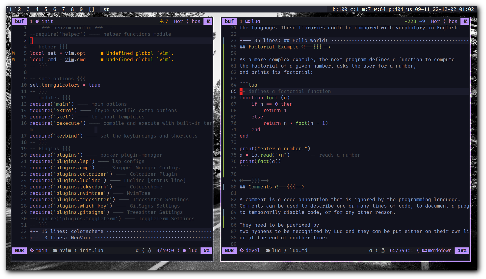

# nvim
Hos's neovim config

Alright! Finally that day have came and I rewrote my `nvim` config with `lua` :)

I've created a module for specific types of work, and I did my best to write
them as modular as possible.

## Dependencies

- Plugin Manager: `packer`
- For LSP:
    - C/C++: `clangd`
    - Python: `pyright`
        - `nodejs`, `npm` or `yarn`
        - Install both python and js modules
    - Bash: `bash-language-server`
        - `nodejs`, `npm` or `yarn`
        - Install js module
    - Lua: `sumneko_lua` (`lua-language-server`)
    - LaTeX: `texlab`
    - Go: `golangci-lint`
- `python`, `python3-neovim`
- `xclip`

## Modules

#### Keep that in mind

This module have to be the **first** module you call, because others have
dependencies on this one.

### Main

This module sets very basic configuration for `nvim`.

Things like:

- Line numbering
- Wrap lines
- Highlight current line
- Set spell check language(s)
- etc...

### Keybind

Contains keybindings for:

- Add/Remove comment [`-`, `+`]
- Compile/Execute programs [`<leader>fw`, `<leader>fe`]
- Enable/Disable **paste** mode [`<C-p>`]
- Enable/Disable **spell check** [`<leader>ss`]
- etc...

### Extra

It adds some extra features like:

- Insert actual <tab> instead of spaces on
    some specific filetypes.
- Make sure to insert spaces instead of <tab>
    on some space-sensitive languages.
- A function to toggle auto-fill `' " { [ (` chars
    and enable the auto-fill for some filetypes.
    - Also auto-fill `_` and `*` for `makrdown` and `rmarkdown` files.

### Skel

If you want to set the leader key [or anything] to `,`
note that I have `,` set to **read some template files located in
`$HOME/.config/nvim/templates/` directory to the current file**.

### cp

#### Screenshot

#### ToDo

- [x] Run and Compile
- [x] Auto Complete `( { [ " '`
- [ ] Write every custom plugins modular
- [ ] Complete the `README.md` file (in progress)
