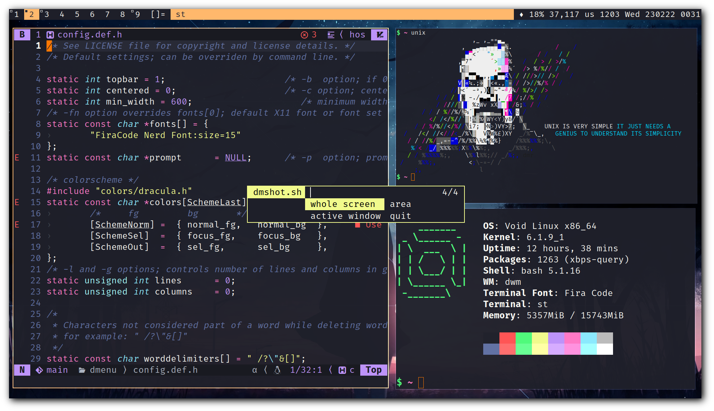

# suckless

Hos's build of suckless tools

This repo contains builds of:

- [dmenu](dmenu/)
- [dwm](dwm/)
- [farbfeld](farbfeld/)
- [sent](sent/)
- [slock](slock/)
- [slstatus](slstatus/)
- [st](st/)
- [tabbed](tabbed/)

# Requirements

To compile suckless tools, you need a C compiler and **GNU Make**:

- gcc
- make

Then you need `pkg-config` to call some libraries.
If you didn't applied any patches (which I have done many)
I believe you don't need this one (still not sure).

Most of the suckless tools needs `X11` and `xft` header files:

- libX11-dev
- libxft-dev

And some others needs different libs due to their nature
and some of patches that I've applied:

### dmenu

- libXinerama-dev
- fribidi-dev

### dwm

- libXinerama-dev
- fribidi-dev

### st

- harfbuzz-dev

### slock

- libXrandr-dev

### farbfeld

- libjpeg-turbo-dev
- libpng-dev

# Screenshot

