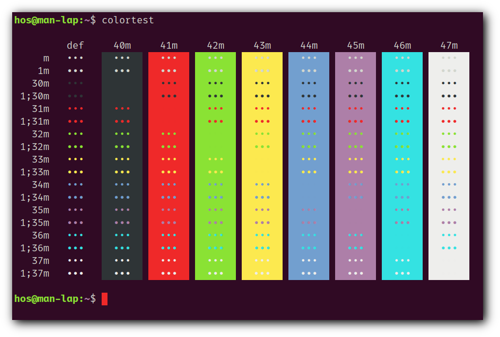

# st - simple terminal

st is a simple terminal emulator for X which sucks less.

## Requirements

In order to build st you need the Xlib header files.

## Installation

Edit config.mk to match your local setup (st is installed into
the /usr/local namespace by default).

Afterwards enter the following command to build and install st (if
necessary as root):

    make clean install

## Running st

If you did not install st with make clean install, you must compile
the st terminfo entry with the following command:

    tic -sx st.info

See the man page for additional details.

## Credits

Based on Aurélien APTEL <aurelien dot aptel at gmail dot com> bt source code.

## Screenshot

- Colorscheme:

| 0. Dracula                                        | 1. Solarized-dark                                |
|:-------------------------------------------------:|:------------------------------------------------:|
|                  |   |

| 2. Gruvbox-dark                                   | 3. Ubuntu                                        |
|:-------------------------------------------------:|:------------------------------------------------:|
|        |                   |

| 4. Ayu-dark                                       | 5. Hos                                           |
|:-------------------------------------------------:|:------------------------------------------------:|
|                |                         |

| 6. Termite                                        | 7. 256_noir                                      |
|:-------------------------------------------------:|:------------------------------------------------:|
|                  |               |

| 8. Solarized-light                                | 9. Default                                       |
|:-------------------------------------------------:|:------------------------------------------------:|
|  |                 |
